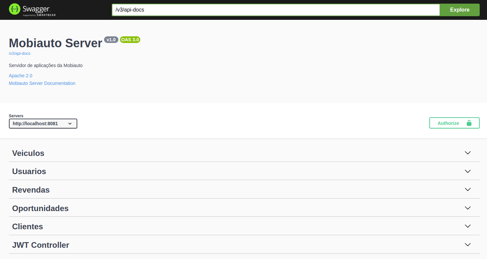
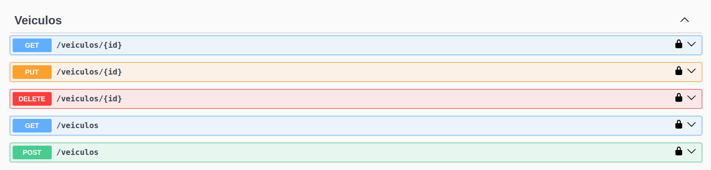
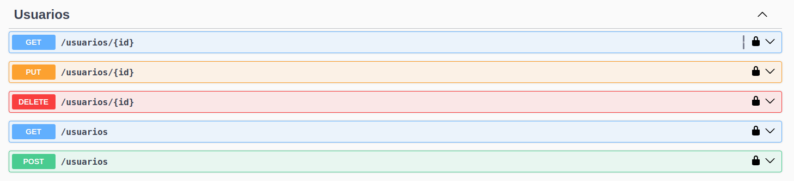
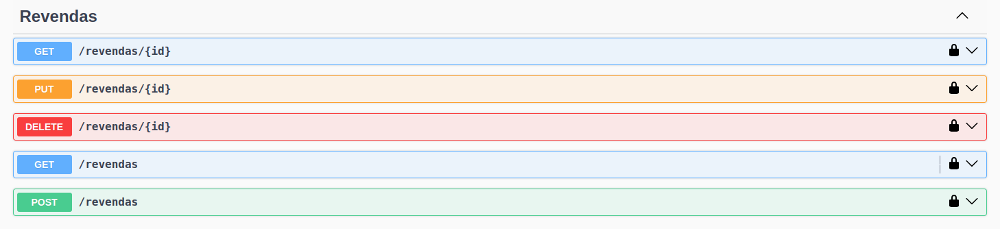
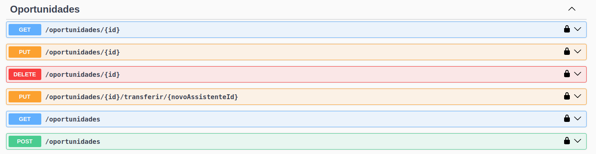
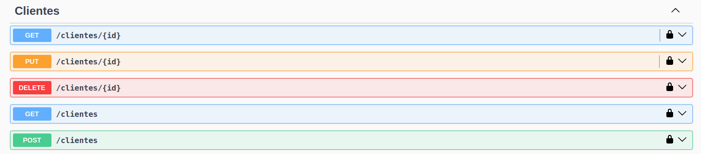
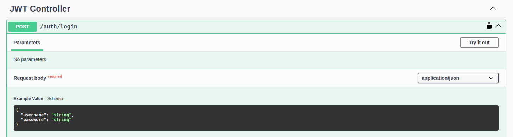

# Mobiauto Server

## Introdução

Bem-vindo ao **Mobiauto Server**! Esta aplicação serve como o backend de um sistema de gerenciamento para a Mobiauto, fornecendo APIs RESTful para manipulação de usuários, revendas, clientes, veículos e oportunidades. A aplicação é construída com o **Spring Boot** e utiliza **JWT** (JSON Web Token) para autenticação e autorização, garantindo que os dados sejam acessados de maneira segura e controlada.

## Visão Geral

### Pré-requisitos

Para executar o Mobiauto Server, você precisará ter instalado:

- **Java 21** - A versão LTS mais recente do JDK para aproveitar os recursos modernos da linguagem.
- **Maven 3.6+** - Ferramenta de build e gerenciamento de dependências.
- **MySQL** - Banco de dados relacional utilizado pela aplicação.
- **Docker** e **Docker Compose** (opcional) - Para execução da aplicação em contêineres.

<div align="center">
    
</div>

### Arquitetura

O Mobiauto Server foi desenvolvido seguindo a arquitetura limpa (Clean Archtecture), onde cada componente da aplicação tem responsabilidades claramente definidas:

- **Spring Boot**: Framework principal para criação da aplicação, fornecendo suporte para configuração automática, segurança, e muito mais.
- **Spring Security com JWT**: Gerencia a autenticação e autorização, garantindo que apenas usuários autenticados possam acessar determinados recursos.
- **Spring Data JPA**: Abstrai o acesso ao banco de dados, facilitando a manipulação de dados persistidos no MySQL.
- **Swagger/OpenAPI**: Gera automaticamente a documentação da API e fornece uma interface interativa para testes.

<div align="center">
    
</div>


### Componentes da Arquitetura

- **Autenticação e Autorização**: Gerenciados pelo Spring Security, com suporte a JWT para autenticação stateless.
- **Persistência**: Implementada com Spring Data JPA, utilizando MySQL como banco de dados principal.
- **Documentação**: A API é documentada e testável através do Swagger, integrado com SpringDoc OpenAPI.
- **Testes**: O projeto inclui uma configuração robusta de testes usando JUnit, Mockito, e Spring Boot Test, garantindo que a aplicação funcione conforme esperado.

## Executando

Obs: o arquivo db/mobiauto.db contém toda a estrutura e schema do banco de dados da aplicação.

### Execução com Docker

Imagem do projeto: `alexandreluchetti/mobiauto-server:latest`

Para facilitar a configuração e execução do Mobiauto Server, você pode usar Docker e Docker Compose. Aqui estão os passos para executar o projeto usando Docker:

Primeiro, clone o repositório:
```bash
git clone https://github.com/seu-usuario/mobiauto-server.git
cd mobiauto-server
```

Execute a Aplicação com Docker Compose: `docker-compose up -d`

Este comando vai iniciar os contêineres para o Mobiauto Server e o banco de dados MySQL. A aplicação estará disponível em `http://localhost:8081`.

Depois que os contêineres estiverem rodando, você pode acessar a documentação da API via Swagger em `http://localhost:8081/swagger-ui.html`.


### Executar o Projeto Manualmente (Alternativa)

Se você preferir rodar o projeto sem Docker, você precisará garantir que todas as dependências estejam instaladas corretamente (Java 21, Maven, MySQL) e então seguir os passos normais de build e execução:

- **Build do Projeto:** `mvn clean install`
- **Executar a Aplicação:**: `java -jar target/mobiauto-server-1.0.0.jar`

## Testes

### Visão Geral
Este projeto inclui uma série de testes de integração focados na camada de controle da aplicação, verificando a interação entre o controller, o serviço e o repositório, bem como a resposta correta aos diferentes cenários de uso da API REST.

Os testes validam as seguintes regras de negócio:

- Apenas administradores podem cadastrar novos usuários, salvos proprietários e
  gerentes que podem cadastrar usuários em sua loja.
- A edição e manutenção de perfis só pode ser realizada por administradores ou
  Proprietários da loja.

```java
public class UsuarioControllerTest {
    void testAdminPodeCriarUsuarios();
    void testGerenteNaoPodeCriarUsuariosDeOutraRevenda();
    void testAssistenteNaoPodeCriarUsuarios();
    void testAdminPodeAtualizarUsuario();
    void testProprietarioNaoPodeAtualizarUsuariosDeOutraRevenda();
    void testAssistenteNaoPodeAtaulizarUsuario();
}
```

- Administradores têm permissão para executar todas as ações em todas as Revendas.
- Usuários só podem acessar lojas que estão vinculados com seu devido cargo.
```java
public class RevendaControllerTest {
    void testAdminPodeCriarRevenda();
    void testAdminPodeAtualizarRevenda();
    void testAdminPodeBuscarRevendaPeloId();
    void testAdminPodeBuscarTodasRevendas();
    void testProprietarioPodeBuscarSuaRevendaPeloId();
    void testProprietarioNaoPodeBuscarOutraRevendaPeloId();
    void testAssistenteNaoPodeAtualizarRevenda();
}
```

- O sistema deve ter a inteligência de distribuir as oportunidades sem responsável para
  os assistentes da loja em forma de fila. Onde o próximo a receber seja o que possui a
  menor quantidade de oportunidades em andamento e maior tempo sem receber
  uma oportunidade.
- Proprietários e gerentes possuem permissão de transferir uma oportunidade para
  outro assistente.
- Apenas o usuário associado à oportunidade pode editá-la, exceto para cargos de
  gerentes e proprietários que têm permissão para editar todas as oportunidades de
  sua loja.
```java
public class OportunidadeControllerTest {
    void testGerentePodeTransferirOportunidade();
    void testAssistenteNaoPodeTransferirOportunidade();
    void testAssistenteNaoPodeEditarOutraOportunidade();
    void testAssistentePodeEditarSuaOportunidade();
    void testGerentePodeEditarQualquerOportunidade();
}
```

### Ferramentas Utilizadas
- **JUnit**: Framework de testes para Java.
- **Spring TestContext Framework**: Integração de testes com o Spring.
- **MockMvc**: Utilizado para testes de controladores Spring MVC.

### Executando os Testes
Para executar os testes, você pode utilizar o Maven ou seu IDE preferido. Aqui estão os comandos para executar os testes via Maven:

```sh
mvn test
```

### Resultados dos Testes
Após a execução dos testes, você pode ver os relatórios de testes gerados na pasta `target/surefire-reports`.

## Configuração e Variáveis de Ambiente


### Dependências

Certifique-se de que todas as dependências estejam instaladas corretamente antes de executar a aplicação. Elas incluem, mas não se limitam a:

- **Spring Boot** (Web, Security, Data JPA)
- **MySQL Connector**
- **Swagger/OpenAPI**
- **JWT (io.jsonwebtoken)**
- **Lombok** (para reduzir código boilerplate)

### Variáveis de Ambiente
- **SPRING_DATASOURCE_URL**: URL do banco de dados.
- **SPRING_DATASOURCE_USERNAME**: Nome de usuário do banco de dados.
- **SPRING_DATASOURCE_PASSWORD**: Senha do banco de dados.
- **JWT_SECRET**: Chave secreta para assinatura dos tokens JWT.
- **JWT_EXPIRATION**: Tempo de expiração dos tokens JWT em milissegundos.

Essas variáveis podem ser configuradas no seu ambiente de desenvolvimento ou no arquivo application.properties.

## Suporte e Contato

Canais de Comunicação
- **Alexandre Lucchetta**
- **E-mail**: luchetti.92@gmail.com
- **Celular**: +55 (16) 99169-9718

## Imagens








